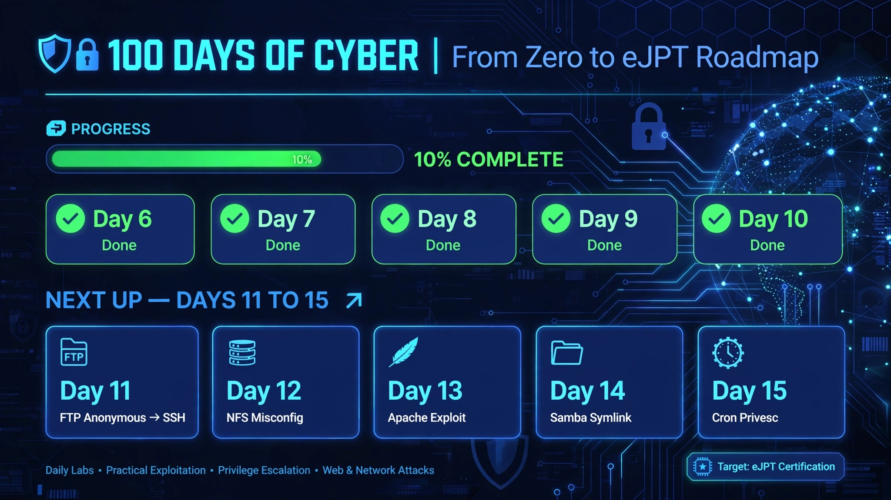

# From-Zero-to-eJPT - 100 Days of Cyber

Documenting my journey from zero to eJPT certification. Hands-on labs, exploits, and writeups.

## Progress Tracker

| Day | Topic | Status | Writeup |
|-----|-------|--------|---------|
| Day-06 | Samba CVE-2007-2447 | ✅ Done | [View](./Day-06-Samba-CVE-2007-2447.md) |
| Day-07 | VSFTPD Backdoor RCE - Manual Trigger | ✅ Done | [View](./Day-7-VSFTPD-Backdoor-RCE.md) |
| Day-08 | Samba Exploit - Root Shell | ✅ Done | [View](./Day-08-Samba-Exploit/) |
| Day-09 | NFS-ROOT-no_root_squash | ✅ Done | [View](./Day-09-NFS-NoRootSquash/) |
| Day-10 | VSFTPD-Backdoor - Netcat vs Metasploit | ✅ Done | [View](./Day-10-VSFTPD-Backdoor/) |
## Structure
Each Day folder contains:
- README.md (steps, commands, learning)
- Proof screenshots (whoami, root)

---
*Started: Oct 2025 | Goal: eJPT Certified*
